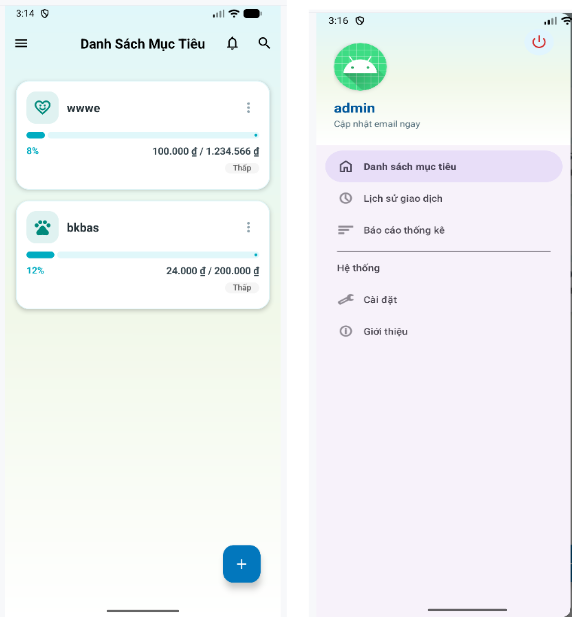
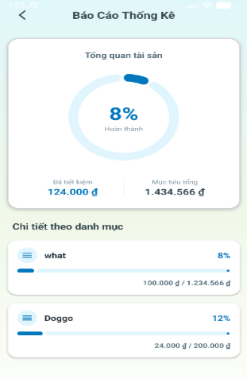

# Đồ Án Lập Trình Di Động Android

Ứng dụng quản lý chi tiêu cá nhân được phát triển trên nền tảng Android

## 🚀 Tính năng nổi bật
* Đăng nhập/Đăng ký tài khoản và bảo mật
* Quản lý, thêm, sửa, xóa dữ liệu trực quan
* Xem báo cáo thống kê trực quan theo biểu đồ

## 📸 Giao diện ứng dụng

| Màn hình chính | Màn hình thống kê |
| :---: | :---: |
|  |  |

## 🛠️ Công nghệ sử dụng
* **Ngôn ngữ:** Kotlin
* **Công cụ phát triển:** Android Studio
* **Cơ sở dữ liệu:** SQLite
